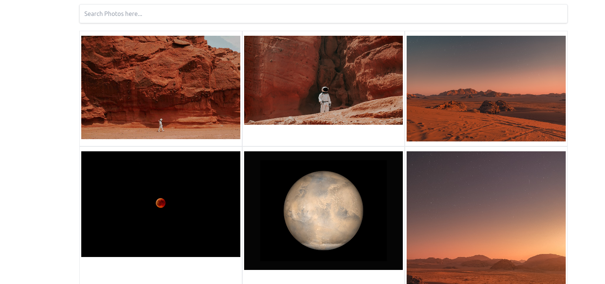

# Images Gallery

## Welcome! 👋

- Live Site URL: [Here](https://jolly-booth-cdd728.netlify.app/)

## Table of contents 🙂

- [Overview](#overview)
  - [Screenshot](#screenshot)
  - [Built with](#built-with)
- [Author](#author)

## Overview

This is a web app that uses the Unplash API to display beautiful images. The goal of this project to learn react and fetching data from a api

### Screenshot 💻

  

### Built with 🧰

- React Js
- TailWind CSS
- Unplash API

## Author

- Linkedin - [@Saliou](https://saliou1920.github.io/Images-Gallery/)
